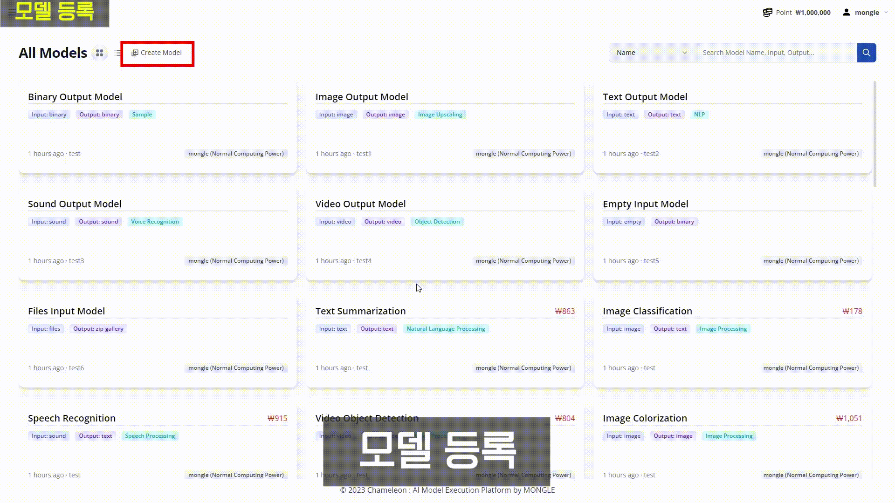
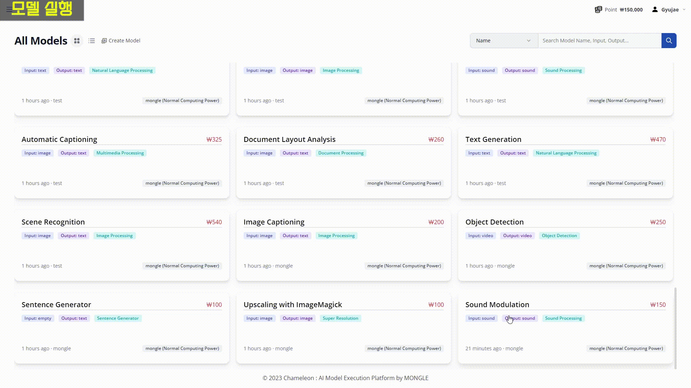
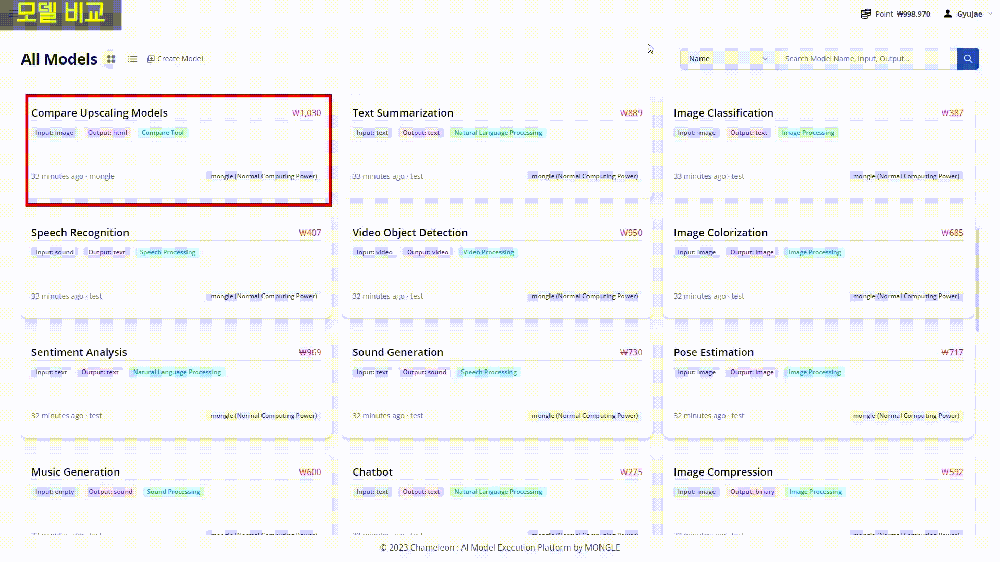
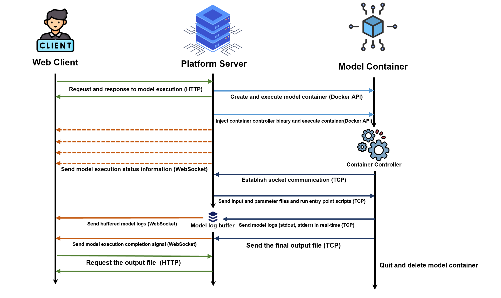

<p align="center"></p>

# Chameleon-Platform
> Platform for Chameleon

It's an execution platform that simplifies the testing and deployment of AI models.

It supports the ability to compare the execution results of multiple AI models, and provides a marketplace system selling virtual goods for developers and users to access and utilize various AI models.

|Create Model|
|---|
||

|Execute Model|
|---|
|| 

|Compare Model|
|---|
||

## Project Structure


## How to communicate



`__tests__`:

`controller`:

`entities`:

`platform`:

`server`:

`service`:

`types`:

`utils`:

## Prerequisites
* Linux envrionment
* Node.js 11.x, `packages.json` dependencies
## Build Guide (Debian)
## Deploy Guide (Docker)
## Live PlayGround

[View Playground](https://dev-client.chameleon.best/)

## How to Contribute
1. Clone repository from develop branch and create a new branch

``` 
git checkout https://github.com/Koreatech-Mongle/chameleon-platform -b name_for_new_branch
```

2. Make Changes and test
3. Submit Pull Request with comprehensive description of changes
